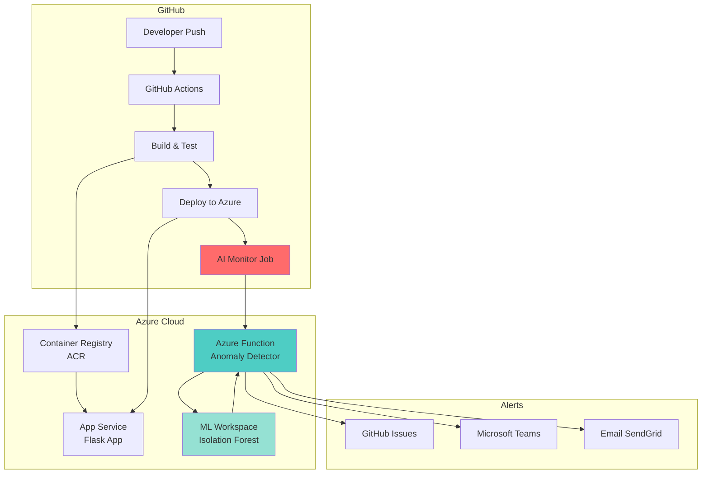

# AI-Powered Anomaly Detection in GitHub Actions CI/CD Pipelines

<!-- Workflow Status Badges -->
[](https://github.com/YOUR_USERNAME/AI-Powered-Anomaly-Detection-in-GitHub-Actions-CI-CD-Pipelines/actions/workflows/terraform-deploy.yml)
[](https://github.com/YOUR_USERNAME/AI-Powered-Anomaly-Detection-in-GitHub-Actions-CI-CD-Pipelines/actions/workflows/ci-cd.yml)
[** | Quick visual overview | Everyone (5 min) |
| **[🎉 PROJECT_COMPLETE.md](./PROJECT_COMPLETE.md)** | Achievement summary & next steps | Everyone (15 min) |
| **[📑 DOCUMENTATION_INDEX.md](./DOCUMENTATION_INDEX.md)** | Master navigation | All roles |
| **[🏗️ ARCHITECTURE_DIAGRAMS.md](./ARCHITECTURE_DIAGRAMS.md)** | Visual system flows | Architects |
| **[⚡ QUICK_REFERENCE.md](./QUICK_REFERENCE.md)** | Daily commands | DevOps |
| **[🧪 TESTING_GUIDE.md](./TESTING_GUIDE.md)** | Testing procedures | QA, DevOps |
| **[🤖 AI_ANOMALY_DETECTION_OVERVIEW.md](./AI_ANOMALY_DETECTION_OVERVIEW.md)** | ML architecture | Technical leads |
| **[📊 ML_ANOMALY_DETECTION_GUIDE.md](./ML_ANOMALY_DETECTION_GUIDE.md)** | Model details | Data scientists |
| **[⚡ AZURE_FUNCTION_README.md](./AZURE_FUNCTION_README.md)** | Function guide | Backend devs |
| **[📈 PROJECT_STATUS.md](./PROJECT_STATUS.md)** | Status & roadmap | Managers |

---

## 🤝 Contributing

We welcome contributions! Here's how you can help:

### How to Contribute

1. Fork the repository
2. Create a feature branch (`git checkout -b feature/amazing-feature`)
3. Commit your changes (`git commit -m 'feat: Add amazing feature'`)
4. Push to the branch (`git push origin feature/amazing-feature`)
5. Open a Pull Request

### Areas for Contribution
- 🐛 Bug fixes and improvements
- ✨ New features (Slack/PagerDuty integration, etc.)
- 📚 Documentation enhancements
- 🧪 Additional test coverage
- 🤖 ML model improvements
- 🎨 Dashboard development

### Report Issues
Found a bug? [Open an issue](https://github.com/YOUR_USERNAME/YOUR_REPO/issues) with:
- Clear description
- Steps to reproduce
- Expected vs actual behavior
- Environment details

---

## 📝 License

This project is licensed under the MIT License - open for educational and commercial use.

---

## 📞 Support & Community

- 📖 **Documentation**: Complete guides in this repository
- 💬 **Discussions**: [GitHub Discussions](https://github.com/YOUR_USERNAME/YOUR_REPO/discussions)
- 🐛 **Issues**: [GitHub Issues](https://github.com/YOUR_USERNAME/YOUR_REPO/issues)
- ⚡ **Quick Help**: [QUICK_REFERENCE.md](./QUICK_REFERENCE.md)

---

<div align="center">

### 🚀 Ready to Deploy?

**[📖 Complete Guide](./PROJECT_COMPLETE.md)** | **[⚡ Quick Reference](./QUICK_REFERENCE.md)** | **[🧪 Testing](./TESTING_GUIDE.md)**

---

**Built with ❤️ using Azure, GitHub Actions, and Machine Learning**

⭐ Star | 🍴 Fork | 📢 Share

**[Report Bug](https://github.com/YOUR_USERNAME/YOUR_REPO/issues)** · **[Request Feature](https://github.com/YOUR_USERNAME/YOUR_REPO/issues)** · **[Contribute](#-contributing)**

---

**Version 1.0.0** | **Status: 🟢 Production Ready** | **Last Updated: December 2025**

</div>ps://github.com/YOUR_USERNAME/AI-Powered-Anomaly-Detection-in-GitHub-Actions-CI-CD-Pipelines/actions/workflows/train-ml-model.yml)
[](https://github.com/YOUR_USERNAME/AI-Powered-Anomaly-Detection-in-GitHub-Actions-CI-CD-Pipelines/actions/workflows/deploy-function.yml)


---

## 📖 Project Overview

A **production-ready DevOps solution** that deploys a Flask web application to Azure App Service with automated CI/CD pipelines and **AI-powered anomaly detection**. Every pipeline run is automatically analyzed by machine learning to detect performance issues, failures, and unusual patterns before they impact production.

### Why This Project?

**Problem**: Traditional CI/CD pipelines lack intelligence. Teams manually monitor builds, react to failures, and miss subtle performance degradations.

**Solution**: This project uses **machine learning (Isolation Forest)** to automatically detect anomalies in pipeline metrics, alerting teams via GitHub Issues, Microsoft Teams, and email—all without manual intervention.

### Key Benefits

- ✅ **Automated Monitoring**: AI analyzes every pipeline run (< 5 seconds)
- ✅ **Early Detection**: Catch issues before they reach production
- ✅ **Zero Secrets**: OIDC authentication (no client secrets stored)
- ✅ **Fully Automated**: Push code → Auto deploy → Auto monitor
- ✅ **Cost-Effective**: Serverless functions, pay per execution
- ✅ **Production-Ready**: Complete infrastructure as code with Terraform

> **🎉 NEW!** [**Project Complete Guide**](./PROJECT_COMPLETE.md) - Your complete system overview and next steps!

---

## 📚 Documentation Hub

### 🚀 Quick Navigation
- **[� Project Complete Guide](./PROJECT_COMPLETE.md)** - **START HERE!** Complete system summary
- **[📊 Visual Summary](./VISUAL_SUMMARY.md)** - Quick visual overview (5 min read)
- **[📑 Documentation Index](./DOCUMENTATION_INDEX.md)** - Master navigation for all docs

### 🛠️ Operations & Development
- **[⚡ Quick Reference](./QUICK_REFERENCE.md)** - Daily commands (PowerShell)
- **[🧪 Testing Guide](./TESTING_GUIDE.md)** - Complete testing procedures
- **[🏗️ Architecture Diagrams](./ARCHITECTURE_DIAGRAMS.md)** - Visual system flows

### 🤖 Technical Deep Dives
- **[🤖 AI Anomaly Detection Overview](./AI_ANOMALY_DETECTION_OVERVIEW.md)** - ML system architecture
- **[📊 ML Model Guide](./ML_ANOMALY_DETECTION_GUIDE.md)** - Model training & evaluation
- **[⚡ Azure Function Guide](./AZURE_FUNCTION_README.md)** - Serverless function details
- **[📈 Project Status](./PROJECT_STATUS.md)** - Current status & roadmap

---

## 🏗️ System Architecture

### High-Level Architecture (Mermaid Diagram)



### ASCII Architecture Diagram

```
┌─────────────────────────────────────────────────────────────────┐
│                          GitHub                                  │
│  Developer → Push Code → GitHub Actions                         │
│                              ↓                                   │
│  ┌──────────┐    ┌──────────┐    ┌────────────────────────┐   │
│  │  Build   │───▶│  Deploy  │───▶│  AI Monitor (NEW!)     │   │
│  │  & Test  │    │          │    │  - Collect metrics     │   │
│  └──────────┘    └────┬─────┘    │  - Call Azure Function │   │
│                       │           │  - Detect anomalies    │   │
└───────────────────────┼───────────┴──────────┬─────────────────┘
                        │                       │
                        │                       │
        ┌───────────────┼───────────────────────┼──────────────────┐
        │               ▼                       ▼                   │
        │  ┏━━━━━━━━━━━━━━━━━━━━━━━━━━━━━━━━━━━━━━━━━━━━━━━━━┓  │
        │  ┃            Azure Cloud Infrastructure            ┃  │
        │  ┗━━━━━━━━━━━━━━━━━━━━━━━━━━━━━━━━━━━━━━━━━━━━━━━━━┛  │
        │                                                          │
        │  ┌─────────────────────┐      ┌────────────────────┐  │
        │  │  Container Registry │      │   App Service      │  │
        │  │  (ACR)              │─────▶│   Flask Web App    │  │
        │  │  - Docker Images    │      │   - Health Check   │  │
        │  └─────────────────────┘      └────────────────────┘  │
        │                                                          │
        │  ┌──────────────────────────────────────────────────┐  │
        │  │  Azure Function (Anomaly Detector)               │  │
        │  │  ┌────────────┐  ┌──────────────┐               │  │
        │  │  │ HTTP       │  │ Timer        │               │  │
        │  │  │ Trigger    │  │ Trigger      │               │  │
        │  │  └─────┬──────┘  └──────┬───────┘               │  │
        │  │        │                 │                        │  │
        │  │        └────────┬────────┘                        │  │
        │  │                 ▼                                 │  │
        │  │     ┌──────────────────────┐                     │  │
        │  │     │  Load ML Model       │                     │  │
        │  │     │  Predict Anomalies   │                     │  │
        │  │     └──────────┬───────────┘                     │  │
        │  └────────────────┼──────────────────────────────────┘  │
        │                   │                                      │
        │  ┌────────────────▼──────────────────────────────────┐  │
        │  │  ML Workspace                                     │  │
        │  │  ┌─────────────────┐  ┌───────────────────────┐ │  │
        │  │  │ Isolation Forest│  │ Application Insights  │ │  │
        │  │  │ Model (Trained) │  │ + Key Vault + Storage │ │  │
        │  │  └─────────────────┘  └───────────────────────┘ │  │
        │  └───────────────────────────────────────────────────┘  │
        └──────────────────────────┬──────────────────────────────┘
                                   │
                                   │ Anomaly Detected!
                                   ▼
        ┌──────────────────────────────────────────────────────────┐
        │                Alert Channels                             │
        │  ┌────────────┐  ┌────────────┐  ┌────────────────────┐ │
        │  │  GitHub    │  │ Microsoft  │  │  Email             │ │
        │  │  Issues    │  │   Teams    │  │  (SendGrid)        │ │
        │  │  📋        │  │    💬      │  │     📧             │ │
        │  └────────────┘  └────────────┘  └────────────────────┘ │
        └──────────────────────────────────────────────────────────┘
```

---

## 💻 Tech Stack

| Category | Technologies |
|----------|-------------|
| **Cloud Provider** | Azure (App Service, Container Registry, ML Workspace, Functions, Key Vault, Storage) |
| **Infrastructure** | Terraform (Infrastructure as Code), Azure Resource Manager |
| **CI/CD** | GitHub Actions (4 workflows), OIDC Authentication |
| **Application** | Python 3.11, Flask, Gunicorn, Docker |
| **Machine Learning** | Azure ML, scikit-learn, Isolation Forest Algorithm |
| **Serverless** | Azure Functions (Python), HTTP + Timer Triggers |
| **Monitoring** | Application Insights, Azure Monitor, Custom ML Anomaly Detection |
| **Alerting** | GitHub API, Microsoft Teams Webhooks, SendGrid Email |
| **Testing** | Pytest, Coverage.py |
| **Security** | OIDC, Managed Identities, Azure Key Vault, HTTPS-only |

---

## 🚀 Quick Start (5 Steps)

### Prerequisites
- Azure account with active subscription
- Azure CLI installed ([Download](https://learn.microsoft.com/cli/azure/install-azure-cli))
- GitHub account with repository
- Git installed locally

### Step 1: Clone the Repository

```powershell
git clone https://github.com/YOUR_USERNAME/AI-Powered-Anomaly-Detection-in-GitHub-Actions-CI-CD-Pipelines.git
cd AI-Powered-Anomaly-Detection-in-GitHub-Actions-CI-CD-Pipelines
```

### Step 2: Setup Azure OIDC Authentication

```powershell
# Login to Azure
az login

# Set variables
$APP_NAME = "github-actions-flask-app"
$SUBSCRIPTION_ID = (az account show --query id -o tsv)
$TENANT_ID = (az account show --query tenantId -o tsv)

# Create App Registration
az ad app create --display-name $APP_NAME
$APP_ID = (az ad app list --display-name $APP_NAME --query "[0].appId" -o tsv)

# Create Service Principal
az ad sp create --id $APP_ID

# Assign Contributor role
az role assignment create `
  --assignee $APP_ID `
  --role "Contributor" `
  --scope "/subscriptions/$SUBSCRIPTION_ID"

Write-Host "✅ App ID: $APP_ID"
Write-Host "✅ Tenant ID: $TENANT_ID"
Write-Host "✅ Subscription ID: $SUBSCRIPTION_ID"
```

### Step 3: Configure Federated Credentials in Azure Portal

1. Go to **Azure Portal** → **Azure Active Directory** → **App registrations**
2. Find your app (`github-actions-flask-app`)
3. Go to **Certificates & secrets** → **Federated credentials** → **Add credential**
4. Select **GitHub Actions deploying Azure resources**
5. Fill in:
   - **Organization**: Your GitHub username/org
   - **Repository**: `AI-Powered-Anomaly-Detection-in-GitHub-Actions-CI-CD-Pipelines`
   - **Entity type**: `Branch`
   - **Branch name**: `main`
   - **Name**: `github-actions-main`
6. Click **Add**

### Step 4: Create Terraform State Storage & Set GitHub Secrets

```powershell
# Create Terraform state storage
az group create --name terraform-state-rg --location westeurope

az storage account create `
  --name tfstatedevopsdelk `
  --resource-group terraform-state-rg `
  --location westeurope `
  --sku Standard_LRS

$ACCOUNT_KEY = (az storage account keys list `
  --resource-group terraform-state-rg `
  --account-name tfstatedevopsdelk `
  --query '[0].value' -o tsv)

az storage container create `
  --name tfstate `
  --account-name tfstatedevopsdelk `
  --account-key $ACCOUNT_KEY

Write-Host "✅ Terraform state storage created"

# Set GitHub secrets (use GitHub CLI or manually in GitHub UI)
gh secret set AZURE_CLIENT_ID --body $APP_ID
gh secret set AZURE_TENANT_ID --body $TENANT_ID
gh secret set AZURE_SUBSCRIPTION_ID --body $SUBSCRIPTION_ID

Write-Host "✅ GitHub secrets configured"
```

> **Note**: If you don't have GitHub CLI, set secrets manually:
> 1. Go to your GitHub repository
> 2. **Settings** → **Secrets and variables** → **Actions**
> 3. Add the three secrets above

### Step 5: Configure Terraform Variables & Deploy

```powershell
# Edit terraform/terraform.tfvars with unique names
# IMPORTANT: Change these values!
@"
acr_name         = "yourcompanyacr$(Get-Random -Maximum 9999)"  # Globally unique
app_service_name = "yourcompany-flask-$(Get-Random -Maximum 999)"  # Globally unique
resource_group_name    = "flask-app-rg"
location              = "westeurope"
app_service_plan_name = "flask-app-plan"
"@ | Out-File -FilePath terraform\terraform.tfvars -Encoding utf8

# Commit and push to trigger deployment
git add .
git commit -m "Initial setup: Configure infrastructure"
git push origin main

Write-Host "✅ Deployment triggered! Check GitHub Actions for progress."
Write-Host "🌐 Watch: https://github.com/YOUR_USERNAME/YOUR_REPO/actions"
```

---

## 📊 Usage & Monitoring

### Monitor Workflow Progress

```powershell
# Using GitHub CLI
gh run watch

# Or visit GitHub Actions in your browser
# https://github.com/YOUR_USERNAME/YOUR_REPO/actions
```

### Access Your Deployed Application

```powershell
# Get App Service URL from Azure
$APP_NAME = "yourcompany-flask-001"  # Your app name from terraform.tfvars
$APP_URL = "https://$(az webapp show --name $APP_NAME --resource-group flask-app-rg --query defaultHostName -o tsv)"

Write-Host "🌐 Application URL: $APP_URL"
Write-Host "🏥 Health Check: $APP_URL/health"

# Test health endpoint
Invoke-WebRequest -Uri "$APP_URL/health"
```

### View Anomaly Detection Results

```powershell
# Check for anomaly issues
gh issue list --label anomaly

# View recent workflow runs
gh run list --limit 5

# Download anomaly reports
gh run download <run-id> --name anomaly-detection-report
```

### Check Azure Resources

```powershell
# List all resources
az resource list --resource-group flask-app-rg --output table

# Check App Service logs
az webapp log tail --name $APP_NAME --resource-group flask-app-rg

# Check Azure Function logs
az webapp log tail --name <function-app-name> --resource-group flask-app-rg
```

### Trigger Manual ML Model Training

```powershell
# Using GitHub CLI
gh workflow run train-ml-model.yml

# Or manually in GitHub UI:
# Actions → Train ML Model → Run workflow
```

---

## 🔄 How It Works

### 1. **You Push Code**
```
Developer → git push → GitHub Actions triggered
```

### 2. **Automated Build & Deploy**
```
GitHub Actions:
  ├─ 🧪 Run tests (pytest + coverage)
  ├─ 🐳 Build Docker image
  ├─ 📦 Push to Azure Container Registry
  └─ 🚀 Deploy to App Service
```

### 3. **AI Monitoring (Automatic)**
```
Monitor Job:
  ├─ 📊 Collect metrics (duration, failure_rate)
  ├─ ☁️  Call Azure Function endpoint
  ├─ 🤖 ML model predicts: Normal or Anomaly?
  └─ 🚨 Alert if anomaly detected
```

### 4. **Smart Alerting**
```
IF Anomaly:
  ├─ 📋 Create GitHub Issue (with details)
  ├─ 💬 Send Teams notification
  ├─ 📧 Send email alert (SendGrid)
  └─ ⚠️  (Optional) Fail build
ELSE:
  └─ ✅ Log success, continue
```

---

## 🎯 What Makes This Special?

### 🤖 AI-Powered Intelligence
- **Machine Learning**: Isolation Forest algorithm trained on your pipeline history
- **Real-time Detection**: Analyzes every pipeline run in < 5 seconds
- **Predictive**: Catches issues before they become critical
- **Self-Learning**: Adapts to your pipeline patterns over time

### 🔐 Secure by Default
- **No Secrets Stored**: OIDC authentication (federated credentials)
- **Managed Identities**: Azure resources authenticate automatically
- **Key Vault Integration**: Secure secret management
- **HTTPS Only**: All traffic encrypted

### 💰 Cost-Effective
- **Serverless Functions**: Pay only for executions (< $0.01 per run)
- **Efficient Containers**: Optimized Docker images
- **Resource Optimization**: Right-sized Azure resources
- **Transparent Costs**: Built-in cost tracking

### 📊 Production-Ready
- **Infrastructure as Code**: Everything version-controlled
- **Automated Testing**: Pytest with coverage reports
- **Multi-Channel Alerts**: GitHub, Teams, Email
- **Comprehensive Docs**: 10 documentation files, 50,000+ words

---

## 🛠️ Infrastructure Components

### Created by Terraform

| Resource | Purpose | Details |
|----------|---------|---------|
| **Resource Group** | Container for all resources | `flask-app-rg` |
| **Container Registry (ACR)** | Private Docker registry | Stores Flask app images |
| **App Service Plan** | Hosting plan | Linux, B1 tier |
| **App Service** | Web application host | Containerized Flask app |
| **ML Workspace** | Machine learning platform | Model training & inference |
| **Key Vault** | Secrets management | API keys, connection strings |
| **Application Insights** | Monitoring & logging | Performance metrics |
| **Storage Account** | Data storage | ML artifacts, logs |
| **Function App** | Serverless compute | Anomaly detection logic |
| **Terraform State Storage** | State management | Remote backend |

### GitHub Actions Workflows

| Workflow | Trigger | Purpose |
|----------|---------|---------|
| `terraform-deploy.yml` | Push to `terraform/**` | Deploy infrastructure |
| `ci-cd.yml` | Push to `main` | Build, deploy, monitor app |
| `train-ml-model.yml` | Weekly / Manual | Train ML model |
| `deploy-function.yml` | Push to function code | Deploy Azure Function |

---

## 🧪 Testing & Validation

### Run Tests Locally

```powershell
# Install dependencies
pip install -r requirements.txt
pip install pytest pytest-cov

# Run tests with coverage
pytest --cov=. --cov-report=term --cov-report=html

# View coverage report
Start-Process .\htmlcov\index.html
```

### Test Docker Build

```powershell
# Build image
docker build -t flask-app:test .

# Run container
docker run -d -p 8000:8000 --name test-app flask-app:test

# Test endpoints
Invoke-WebRequest -Uri "http://localhost:8000/health"
Invoke-WebRequest -Uri "http://localhost:8000/"

# Clean up
docker stop test-app
docker rm test-app
```

### Validate Terraform

```powershell
cd terraform
terraform init
terraform validate
terraform plan
```

For complete testing procedures, see **[TESTING_GUIDE.md](./TESTING_GUIDE.md)**.

---
     - Creates GitHub issues for anomalies
     - Sends Teams/email alerts
     - Optional: Fails build on critical anomalies

3. **ML Model Training** (`.github/workflows/train-ml-model.yml`)
   - Trains Isolation Forest model for anomaly detection
   - Analyzes CI/CD pipeline metrics (duration, failure rate)
   - Registers model in Azure ML
   - Runs weekly or on-demand

4. **Azure Function Deployment** (`.github/workflows/deploy-function.yml`)
   - Deploys serverless anomaly detection function
   - Configures environment variables
   - Sets up managed identity permissions

## 🚀 Features

### Core Infrastructure
- **Infrastructure as Code**: Complete Azure infrastructure defined in Terraform
- **OIDC Authentication**: Secure, keyless authentication to Azure (no client secrets!)
- **Automated Testing**: Pytest with coverage reporting
- **Docker Containerization**: Consistent deployment across environments
- **Health Checks**: Built-in health monitoring endpoints
- **Managed Identity**: App Service uses managed identity to pull from ACR
- **Workflow Dependencies**: App deployment waits for infrastructure provisioning

### AI-Powered Monitoring 🤖
- **Real-time Anomaly Detection**: ML-powered analysis of every pipeline run
- **Isolation Forest Model**: Unsupervised learning on pipeline metrics
- **Automatic Alerting**: GitHub issues, Microsoft Teams, and email notifications
- **Predictive Analytics**: Detect performance degradation before failures
- **Historical Tracking**: Trend analysis and anomaly artifact storage
- **Customizable Thresholds**: Adjust sensitivity per environment
- **Auto-remediation Ready**: Optional build failure on anomalies

## 📋 Prerequisites

1. **Azure Account** with an active subscription
2. **Azure CLI** installed locally (for initial setup)
3. **Terraform** >= 1.0 installed locally (optional, for local testing)
4. **GitHub Repository** with Actions enabled

## 🔧 Setup Instructions

### Step 1: Create Azure App Registration for OIDC

```bash
# Login to Azure
az login

# Create App Registration
az ad app create --display-name "github-actions-flask-app"

# Get the Application (client) ID
APP_ID=$(az ad app list --display-name "github-actions-flask-app" --query "[0].appId" -o tsv)
echo "Application ID: $APP_ID"

# Create Service Principal
az ad sp create --id $APP_ID

# Get Tenant and Subscription IDs
TENANT_ID=$(az account show --query tenantId -o tsv)
SUBSCRIPTION_ID=$(az account show --query id -o tsv)

echo "Tenant ID: $TENANT_ID"
echo "Subscription ID: $SUBSCRIPTION_ID"
```

### Step 2: Configure Federated Credentials

In Azure Portal:
1. Go to **Azure Active Directory** → **App registrations**
2. Find your app registration
3. Go to **Certificates & secrets** → **Federated credentials**
4. Click **Add credential**
5. Select **GitHub Actions deploying Azure resources**
6. Fill in:
   - **Organization**: Your GitHub username/organization
   - **Repository**: `AI-Powered-Anomaly-Detection-in-GitHub-Actions-CI-CD-Pipelines`
   - **Entity type**: `Branch`
   - **Based on selection**: `main`
   - **Name**: `github-actions-main`
7. Click **Add**

### Step 3: Assign Azure Permissions

```bash
# Assign Contributor role to the service principal
az role assignment create \
  --assignee $APP_ID \
  --role "Contributor" \
  --scope "/subscriptions/$SUBSCRIPTION_ID"

# Optional: If you want to use Managed Identity for ACR pull (instead of admin credentials)
# Assign User Access Administrator role (required for role assignments in Terraform)
az role assignment create \
  --assignee $APP_ID \
  --role "User Access Administrator" \
  --scope "/subscriptions/$SUBSCRIPTION_ID"
```

**Note**: The Contributor role is sufficient for basic deployment. User Access Administrator is only needed if you want to enable the managed identity role assignment in `resources.tf`.

### Step 4: Create Terraform State Storage

```bash
# Create resource group for Terraform state
az group create --name terraform-state-rg --location westeurope

# Create storage account (name must be globally unique, lowercase, alphanumeric)
az storage account create \
  --name tfstatedevopsdelk \
  --resource-group terraform-state-rg \
  --location westeurope \
  --sku Standard_LRS \
  --encryption-services blob

# Get storage account key
ACCOUNT_KEY=$(az storage account keys list \
  --resource-group terraform-state-rg \
  --account-name tfstatedevopsdelk \
  --query '[0].value' -o tsv)

# Create blob container
az storage container create \
  --name tfstate \
  --account-name tfstatedevopsdelk \
  --account-key $ACCOUNT_KEY
```

### Step 5: Configure GitHub Secrets

In your GitHub repository, go to **Settings** → **Secrets and variables** → **Actions** and add:

- `AZURE_CLIENT_ID`: The Application (client) ID from Step 1
- `AZURE_TENANT_ID`: The Tenant ID from Step 1
- `AZURE_SUBSCRIPTION_ID`: The Subscription ID from Step 1

### Step 6: Update Terraform Variables

Edit `terraform/terraform.tfvars` to use globally unique names:

```hcl
# IMPORTANT: Change these to globally unique values
acr_name         = "yourcompanyacr123"      # Lowercase alphanumeric only, globally unique
app_service_name = "yourcompany-flask-001"  # Globally unique across all Azure

# Other settings
resource_group_name    = "flask-app-rg"
location              = "westeurope"
app_service_plan_name = "flask-app-plan"
```

**Note**: 
- Authentication (subscription_id, client_id, tenant_id) is handled via OIDC environment variables in GitHub Actions. No client secret is needed!
- ACR names must be 5-50 characters, lowercase letters and numbers only
- App Service names must be globally unique and can contain letters, numbers, and hyphens

## 📁 Project Structure

```
.
├── .github/
│   └── workflows/
│       ├── terraform-deploy.yml    # Infrastructure deployment
│       ├── ci-cd.yml               # Application CI/CD
│       └── train-ml-model.yml      # ML model training
├── terraform/
│   ├── main.tf                     # Provider and backend config
│   ├── resources.tf                # Infrastructure resources
│   ├── variables.tf                # Input variables
│   ├── outputs.tf                  # Output values
│   └── terraform.tfvars.example    # Example variables
├── app.py                          # Flask application
├── requirements.txt                # Python dependencies
├── test_app.py                     # Pytest tests
├── Dockerfile                      # Container image definition
└── README.md                       # This file
```

## 🔄 Workflow Execution Order

1. **Push to `main` with Terraform changes:**
   ```
   Terraform Workflow → Provisions Infrastructure → Outputs ACR & App Service details
                                                    ↓
   CI/CD Workflow → Build & Test → Push to ACR → Deploy to App Service
   ```

2. **Push to `main` with only app code changes:**
   ```
   CI/CD Workflow → Build & Test → Push to ACR → Deploy to existing App Service
   ```

3. **Manual trigger or scheduled run for ML model training:**
   ```
   ML Training Workflow → Trains model on Azure ML → Registers model in Azure ML
   ```

## 🧪 Local Development

### Run Flask App Locally

```bash
# Install dependencies
pip install -r requirements.txt

# Run the application
python app.py

# Access at http://localhost:8000
```

### Run Tests

```bash
# Install test dependencies
pip install pytest pytest-cov

# Run tests with coverage
pytest --cov=. --cov-report=term
```

### Build Docker Image Locally

```bash
docker build -t flask-app:latest .
docker run -p 8000:8000 flask-app:latest
```

### Test Terraform Locally

```bash
cd terraform

# Initialize Terraform
terraform init

# Validate configuration
terraform validate

# Plan changes
terraform plan

# Apply (with confirmation)
terraform apply
```

## 📊 Monitoring & Health Checks

The application includes a health check endpoint:

```bash
curl https://your-app-service.azurewebsites.net/health
```

Response:
```json
{
  "status": "healthy"
}
```

## 🔒 Security Best Practices

✅ **OIDC Authentication**: No long-lived secrets in GitHub
✅ **Managed Identity**: App Service uses managed identity to pull from ACR
✅ **HTTPS Only**: All App Service traffic is HTTPS
✅ **Private ACR**: Container registry is private with RBAC
✅ **Terraform State**: Remote state in encrypted Azure Storage
✅ **Sensitive Outputs**: Sensitive Terraform outputs are marked as such

## 🛠️ Troubleshooting

### OIDC Authentication Fails

- Verify federated credentials are configured correctly in Azure
- Check that the subject identifier matches: `repo:ORG/REPO:ref:refs/heads/main`
- Ensure the service principal has Contributor role

### ACR Login Fails

- Verify ACR was created successfully by Terraform
- Check that admin access is enabled on ACR
- Ensure the App Service managed identity has AcrPull role

### Role Assignment Permission Error

If you see: `does not have authorization to perform action 'Microsoft.Authorization/roleAssignments/write'`

**Solution 1** (Recommended for quick start):
- The role assignment is already commented out in `resources.tf`
- App Service uses admin credentials instead (already configured)
- This works fine for development and testing

**Solution 2** (For production with managed identity):
```bash
# Grant User Access Administrator role
az role assignment create \
  --assignee $APP_ID \
  --role "User Access Administrator" \
  --scope "/subscriptions/$SUBSCRIPTION_ID"

# Then uncomment the azurerm_role_assignment block in resources.tf
```

### Terraform State Issues

- Verify storage account `tfstatedevopsdelk` exists
- Check that the `tfstate` container exists
- Ensure service principal has access to the storage account

## � Complete Documentation

This repository includes comprehensive documentation to help you understand, deploy, and maintain the AI-powered anomaly detection system:

### Core Documentation
- **[AI Anomaly Detection Overview](./AI_ANOMALY_DETECTION_OVERVIEW.md)** - Complete system architecture, features, benefits, and how everything works together
- **[Architecture Diagrams](./ARCHITECTURE_DIAGRAMS.md)** - Visual diagrams showing data flow, component interactions, and system architecture
- **[Quick Reference Guide](./QUICK_REFERENCE.md)** - Common commands and operations for day-to-day management
- **[Testing & Validation Guide](./TESTING_GUIDE.md)** - Comprehensive testing procedures for all components

### Component-Specific Guides
- **[ML Anomaly Detection Guide](./ML_ANOMALY_DETECTION_GUIDE.md)** - Detailed ML model documentation, training procedures, and model evaluation
- **[Azure Function Guide](./AZURE_FUNCTION_README.md)** - Serverless function details, configuration, and troubleshooting

### Getting Started
1. Start with this README for initial setup
2. Review [AI_ANOMALY_DETECTION_OVERVIEW.md](./AI_ANOMALY_DETECTION_OVERVIEW.md) to understand the full system
3. Use [QUICK_REFERENCE.md](./QUICK_REFERENCE.md) for common operations
4. Follow [TESTING_GUIDE.md](./TESTING_GUIDE.md) to validate your deployment

## 🎯 What Makes This Special?

### 🤖 AI-Powered Intelligence
- **Machine Learning**: Isolation Forest algorithm trained on your pipeline history
- **Real-time Detection**: Immediate analysis of every pipeline run
- **Predictive**: Catches issues before they become critical
- **Self-Learning**: Adapts to your pipeline patterns over time

### 🚀 Production-Ready
- **Infrastructure as Code**: Everything defined in Terraform
- **No Secrets**: OIDC authentication (no client secrets stored)
- **Scalable**: Serverless Azure Functions auto-scale
- **Monitored**: Application Insights integration
- **Secure**: Managed identities and Key Vault

### 📊 Comprehensive Monitoring
- **Multi-Channel Alerts**: GitHub Issues, Teams, Email
- **Detailed Reporting**: Anomaly scores and recommendations
- **Historical Tracking**: 30-day artifact retention
- **Customizable**: Adjust thresholds per environment

### 🔧 Developer-Friendly
- **Easy Setup**: Step-by-step instructions
- **Well Documented**: Extensive guides and examples
- **Tested**: Complete testing procedures included
- **Maintainable**: Clean code structure and best practices

## �📝 License

This project is provided as-is for educational and demonstration purposes.

## 🤝 Contributing

Contributions are welcome! Please feel free to submit a Pull Request.

---

**Built with ❤️ using Azure, GitHub Actions, and Machine Learning**

For questions or support, please open an issue on GitHub.
